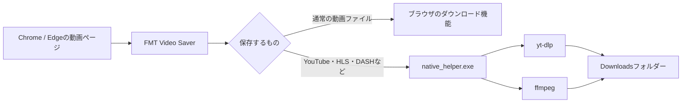

# FMT Video Saver

[](https://github.com/Fortniteleakjp/fmt-video-saver/releases)

ブラウザで再生している動画を見つけて、パソコンに保存するためのChrome / Edge拡張機能です。

プログラミングの知識がなくても使えるように作っています。ただし、この拡張機能は動画の取得や変換を専門の外部ツールに任せているため、最初にいくつかのツールをインストールする必要があります。このREADMEでは、それぞれの役割から順番に説明します。

> **重要:** 動画の保存は、保存する権利がある動画と、各サイトの利用規約で認められている範囲で行ってください。DRMの解除やアクセス制限の回避はできません。

## できること

- YouTubeの動画を、次の3通りで保存
  - 音声のみ（WAV）
  - 映像と音声（MP4）
  - サムネイル（1080p相当の画像）
- MP4、WebM、MOV、MKV、TSなどの動画ファイルを検出して保存
- HLS（`.m3u8`）、DASH（`.mpd`）、F4M（`.f4m`）のストリームを取得・結合
- ログイン中のページで必要になるCookieを、ローカル処理に限って利用
- ダウンロードの進み具合を表示

## まず知っておきたい用語

### ブラウザ拡張機能

ChromeやEdgeに追加して使う小さなアプリです。FMT Video Saverは、現在開いているページ内の動画URLやストリームを探し、保存ボタンを表示します。

### yt-dlp

さまざまな動画サイトから、動画や音声を取得するための無料のコマンドラインツールです。コマンドラインツールとは、黒い画面（PowerShellなど）から命令して使うプログラムのことです。

FMT Video Saver自身が動画サイトの仕組みをすべて実装するのではなく、yt-dlpに「このURLを保存して」と依頼します。

YouTubeの仕様変更が行われて動画をDLできなくなった際はyt-dlpを更新すると解消する可能性があります。

### ffmpeg

動画と音声を処理する無料のツールです。たとえば、YouTubeの映像と音声を1つのMP4にまとめたり、音声をWAVに変換したりするときに使います。

### Node.js

JavaScriptというプログラミング言語を、ブラウザの外で動かすための実行環境です。この拡張機能では、YouTubeの取得時にyt-dlpから呼び出されることがあります。

### Native helper

ブラウザ拡張機能から、パソコンにインストールしたyt-dlpやffmpegを呼び出すための小さな橋渡しプログラムです。リリースに含まれる `native_helper.exe` を使えば、ヘルパー自体をプログラミングする必要はありません。

### PATH（パス）

Windowsがプログラムを探すフォルダーの一覧です。`yt-dlp.exe` や `ffmpeg.exe` をPATHに追加すると、どのフォルダーからでもプログラムを呼び出せるようになります。

## 仕組み



## 必要な環境

- Windows 10 または Windows 11
- Google Chrome または Microsoft Edge
- Node.js 22以上
- yt-dlp
- ffmpeg と ffprobe

### Pythonについて

リリース済みの `native_helper.exe` を使うだけなら、Pythonは実行時には必要ありません。

ただし、yt-dlpをPython経由でインストールする場合はPython 3.10以上が必要です。また、`native_helper.exe` をソースから作り直す場合にもPython 3.10以上が必要です。Pythonを使いたくない場合は、yt-dlpの実行ファイルを直接ダウンロードしてPATHに追加してください。

## インストール

以下は、Windowsで初めてセットアップする方向けの手順です。

### 1. プロジェクトをダウンロードする

簡単な方法は、GitHubページの **Code** → **Download ZIP** です。ZIPを展開し、展開したフォルダーを分かりやすい場所に置いてください。

フォルダーの中に、少なくとも `manifest.json` と `native_helper.exe` があることを確認します。`native_helper.exe` がない場合は、[リリースページ](https://github.com/Fortniteleakjp/fmt-video-saver/releases)からダウンロードして、`manifest.json` と同じフォルダーに置いてください。

### 2. ChromeまたはEdgeに拡張機能を読み込む

1. Chromeでは `chrome://extensions`、Edgeでは `edge://extensions` を開きます。
2. 画面右上の **デベロッパーモード** をオンにします。
3. **パッケージ化されていない拡張機能を読み込む** をクリックします。
4. `manifest.json` が入っているフォルダーを選びます。ZIPファイルそのものではなく、展開後のフォルダーを選んでください。
5. 表示された **拡張機能ID**（32文字の英数字）をコピーしておきます。

### 3. Node.jsをインストールする

[Node.jsの公式ダウンロードページ](https://nodejs.org/en/download)から、Windows用のLTS版をインストールします。インストーラーは基本的に初期設定のままで構いません。

インストール後、PowerShellを開いて次のコマンドを実行します。

```powershell
node --version
```

`v22` 以上のバージョンが表示されれば準備完了です。

### 4. yt-dlpをインストールする

#### 方法A：Pythonでインストールする（おすすめ）

まず、[Pythonの公式サイト](https://www.python.org/downloads/)からPython 3.10以上をインストールします。インストール画面に **Add Python to PATH** が表示された場合は、チェックを入れてください。

PowerShellで次のコマンドを実行します。

```powershell
py -m pip install --upgrade "yt-dlp[default,curl-cffi]"
```

インストールできたか確認します。

```powershell
yt-dlp --version
```

バージョン番号が表示されれば成功です。

#### 方法B：実行ファイルを直接使う

[yt-dlpのリリースページ](https://github.com/yt-dlp/yt-dlp/releases/latest)から `yt-dlp.exe` をダウンロードし、専用フォルダー（例：`C:\Tools\yt-dlp`）に置きます。そのフォルダーをWindowsのPATHに追加し、PowerShellで `yt-dlp --version` が実行できることを確認してください。

PATHの追加方法が分からない場合は、Windowsの検索で **環境変数** と検索し、**環境変数を編集** → **環境変数** → ユーザー環境変数の **Path** → **編集** → **新規** からフォルダーを追加します。PATHを変更した後は、新しいPowerShellを開いてください。

### 5. ffmpegとffprobeをインストールする

ffmpegは公式サイトから直接Windows版を配布していないため、[ffmpeg公式のダウンロードページ](https://ffmpeg.org/download.html)にあるWindowsビルドへのリンクを利用します。

ZIPを展開し、`bin` フォルダーにある次の2つのファイルを確認します。

```text
ffmpeg.exe
ffprobe.exe
```

この2つが入っている `bin` フォルダー（例：`C:\Tools\ffmpeg\bin`）をPATHに追加します。PowerShellで確認します。

```powershell
ffmpeg -version
ffprobe -version
```

どちらもバージョン情報が表示されれば成功です。

### 6. Native helperを登録する

PowerShellで、`manifest.json` と `install-native-host.ps1` があるフォルダーへ移動します。

```powershell
cd "C:\FMT Video Saver"
.\install-native-host.ps1 -ExtensionId "ここに拡張機能ID"
```

`C:\FMT Video Saver` の部分は、実際にファイルを置いた場所に置き換えてください。

このスクリプトは、`native_helper.exe` をChromeとEdgeから起動できるようにWindowsへ登録します。登録が終わったら、ChromeまたはEdgeをいったん完全に終了して起動し直し、動画ページも再読み込みしてください。

> PowerShellに「スクリプトを実行できない」と表示された場合は、現在のPowerShellだけで一時的に許可してから、もう一度実行します。
>
> ```powershell
> Set-ExecutionPolicy -Scope Process -ExecutionPolicy Bypass
> .\install-native-host.ps1 -ExtensionId "ここに拡張機能ID"
> ```

## 使い方

1. ChromeまたはEdgeで動画ページを開きます。
2. 必要であれば動画を一度再生します。
3. ブラウザ右上の拡張機能一覧から **FMT Video Saver** を開きます。
4. 候補が表示されない場合は **更新** を押します。
5. 保存したい項目のボタンを押します。

YouTubeでは、動画ごとに次のボタンが表示されます。

| ボタン | 保存されるもの |
| --- | --- |
| 音声のみ（WAV） | 音声ファイル |
| 映像＋音声のみ（MP4） | 映像と音声を結合したMP4 |
| サムネのみ（1080p） | `maxresdefault.jpg` |

通常のページでは、検出された動画ファイルやストリームごとに **保存** または **結合保存** が表示されます。

### HLS / DASHを保存するとき

HLSやDASHでは、動画本体ではなく「動画を分割して配信するための一覧表」が検出されます。この一覧表をマニフェストと呼びます。

- HLS：`.m3u8`
- DASH：`.mpd`
- F4M：`.f4m`

候補一覧では、個別の動画断片（`.ts` など）ではなく、マニフェストを選んでください。**結合保存**を押すと、yt-dlpとffmpegが動画を取得して1つのファイルにまとめます。

### 保存先を変更する

初期設定では、次のフォルダーに保存されます。

```text
%USERPROFILE%\Downloads
```

保存先を変更する場合は、PowerShellで次のコマンドを実行します。パスは好きな場所に変更してください。

```powershell
[Environment]::SetEnvironmentVariable("FMT_VIDEO_SAVER_DOWNLOAD_DIR", "D:\Videos", "User")
```

設定後にChromeまたはEdgeを再起動すると、新しい保存先が使われます。

ffmpegの場所だけを指定したい場合は、次の環境変数も利用できます。

`FMT_VIDEO_SAVER_FFMPEG`

## うまく動かないとき

### 「候補がありません」と表示される

- ページを再読み込みしてから、動画を再生して **更新** を押してください。
- `blob:` URLや、暗号化された再生APIだけを使うサイトは検出できない場合があります。
- サイト側のCORS、Referer、Cookie、地域設定などにより取得できない場合があります。

### yt-dlpが見つからない

PowerShellで次を実行します。

```powershell
where.exe yt-dlp
yt-dlp --version
```

見つからない場合は、yt-dlpのフォルダーがPATHに入っているか確認し、PATH変更後にChromeまたはEdgeを再起動してください。

### ffmpegまたはffprobeが見つからない

`ffmpeg.exe` と `ffprobe.exe` が同じ `bin` フォルダーにあるか、PATHにその `bin` フォルダーを追加したかを確認します。

```powershell
where.exe ffmpeg
where.exe ffprobe
```

### Native helperのエラーが出る

- `native_helper.exe` が `manifest.json` と同じフォルダーにあるか確認します。
- 拡張機能IDを間違えていないか確認します。
- 拡張機能を削除して読み込み直した場合は、拡張機能IDが変わることがあります。その場合は登録コマンドをもう一度実行してください。
- `install-native-host.ps1` を実行した後、ブラウザを再起動して動画ページを再読み込みしてください。

### YouTubeだけ失敗する

YouTubeの仕様変更が原因の可能性があります。yt-dlpを更新し、Node.jsがPATHから実行できるか確認してください。

```powershell
py -m pip install --upgrade "yt-dlp[default,curl-cffi]"
node --version
yt-dlp --version
```

## Cookieとセキュリティ

ログインが必要な動画では、拡張機能が現在のタブと動画URLに適用されるCookieを読み取り、一時ファイルにしてローカルの `native_helper.exe` へ渡します。処理が終わると、その一時ファイルは削除されます。Cookieを外部サーバーへ送信する処理はありません。

一方で、この拡張機能にはCookieを読み取る権限と、すべてのWebサイト上で動作する権限があります。Cookieはログイン状態を維持する重要な情報です。コードと `native_helper.exe` の入手元を確認したうえで使用し、不要になったら拡張機能を削除してください。

## 制限事項

- DRMで保護された動画の解除には対応していません。
- ログイン制限、地域制限、アクセス制限の回避は行いません。
- `blob:` URLや暗号化された再生APIのみを使うサイトでは、動画を検出できない場合があります。
- サイトの仕様変更により、突然動作しなくなることがあります。
- YouTubeの仕様変更時には、yt-dlpやNode.jsの更新が必要になる場合があります。
- 動画の権利、著作権、各サイトの利用規約を確認してから使用してください。

## ソースからNative helperを作る場合

通常はリリースに含まれる `native_helper.exe` を使えば十分です。自分でビルドしたい場合だけ、Python 3.10以上とPyInstallerを用意してください。

```powershell
.\build-native-helper.ps1
.\install-native-host.ps1 -ExtensionId "拡張機能ID"
```

`build-native-helper.ps1` はPyInstallerをインストールし、`native_helper.py` を `native_helper.exe` に変換します。

## ファイル構成

```text
manifest.json                       Chrome / Edge拡張機能の設定
background.js                       動画検出、保存、Native Messaging処理
content.js                          ページ内の動画とYouTube情報の検出
popup.html / popup.js               保存候補を表示する画面
popup.css                           ポップアップ画面のデザイン
native_helper.py                    yt-dlp / ffmpegを呼び出すヘルパーのソース
native_helper.exe                   ビルド済みのNative helper
install-native-host.ps1             Native helperをChrome / Edgeへ登録するスクリプト
build-native-helper.ps1             Native helperをビルドするスクリプト
native-host-manifest.template.json  Native Messaging設定のテンプレート
```

## ライセンス

現在、このリポジトリにはライセンスファイルがありません。利用・改変・再配布を行う場合は、リポジトリの管理者に確認してください。
